# 📋 Agent Leak Application - 트러블슈팅 리포트 (과제 B1-2)

본 리포트는 `agent-leak-app` 시스템 안정성 테스트 중 발생한 주요 자원 관리 및 동시성 제어 결함(Bug)에 대한 원인 분석과 조치 및 검증 결과를 기록한 문서입니다.

---

## 🔍 목차
1. [[Bug 1] 메모리 임계치 초과로 인한 에이전트 프로세스 강제 종료](#bug-1-메모리-임계치-초과로-인한-에이전트-프로세스-강제-종료)
2. [[Bug 2] 내부 가상 부하 계산 오류로 인한 Watchdog 프로세스 강제 종료](#bug-2-내부-가상-부하-계산-오류로-인한-watchdog-프로세스-강제-종료)
3. [[Bug 3] 동시성 제어 오류 - 멀티스레드 교착 상태 (Deadlock)](#bug-3-동시성-제어-오류---멀티스레드-교착-상태-deadlock)

---

## 🛑 [Bug 1] 메모리 임계치 초과로 인한 에이전트 프로세스 강제 종료

### 1. 현상 설명 (Description)
* **발생 현상:** 특정 메모리 임계치(256MB)로 설정된 프로세스(PID: 30235)가 힙 메모리 급증으로 인해 자체 종료(Self-terminated)되거나 OS에 의해 강제 종료(Killed)되었습니다.
* **발생 조건:** * 발생 시각: 18시 21분 44초 
  * 하드웨어 제약: Memory Limit 216MB / CPU Limit 50% / Thread Concurrency False (단일 스레드 모드) 
  * 진행 상황: `MemoryWorker` 구동(18시 21분 14초) 후 약 30초 동안 힙 메모리가 25MB에서 시작하여 3초마다 약 25MB씩 선형적으로 지속 상승함.
### 1-2. 증거자료 (Evidence & Logs)
* agent-app-leak 실행 로그
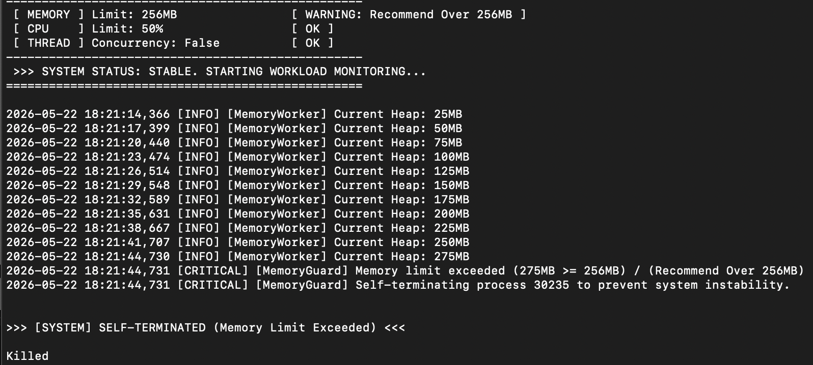
* monitor.log 출력 로그
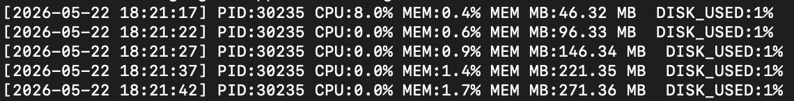
### 2. 원인 분석 (Root Cause Analysis)
* **구조적 원인:** `MemoryWorker`가 동작하는 동안 메모리가 일정 주기로 계속 우상향하는 패턴을 보이며, 애플리케이션 내부에 메모리 캐시가 지속적으로 누적되는 구조적 결함이 존재합니다.
* **가드 메커니즘 트리거:** 내부 메모리 회수 로직('Cleanup')이 발동하기 전, `MemoryGuard`가 설정한 절대적 제한치(256MB)에 먼저 도달하여 방어 코드가 무조건적인 프로세스 종료를 선택했습니다.
* **OS 동작 원리:** OS 관점에서는 프로세스가 물리 메모리(RSS)를 지속적으로 요구하는 상황이었으며, 컨테이너/프로세스 제한을 넘어서는 순간 시스템 가용성 저하를 막기 위해 커널이 `SIGKILL (Signal 9)` 시그널을 보내 자원을 강제 회수("Killed")했습니다.

### 3. 조치 및 검증 (Workaround & Verification)
* **환경변수 조정:** `APP_MEMORY_LIMIT`를 기존 **256MB에서 512MB로 2배 확장**하여 캐시 청소 및 GC 로직이 작동할 수 있는 최소한의 버퍼 가용 공간을 확보했습니다.
* **검증 결과:**
  * 환경변수 정상 반영 완료 (`MEMORY Limit: 512MB [ OK ]`).
  * 힙 메모리가 기존 임계치를 넘어 525MB에 도달했을 때 프로세스가 종료되지 않고 내장된 메모리 회수 로직(`Starting cleanup...`)이 정상 트리거됨을 확인했습니다.
  * 캐시 플러시 직후 힙 메모리가 525MB에서 25MB로 급격히 감소하며 자원이 성공적으로 회수되어 안정화되었습니다.
### 3-2. 증거자료 (Evidence & Logs)
* 환경변수 조정 후 agent-app-leak 실행 로그
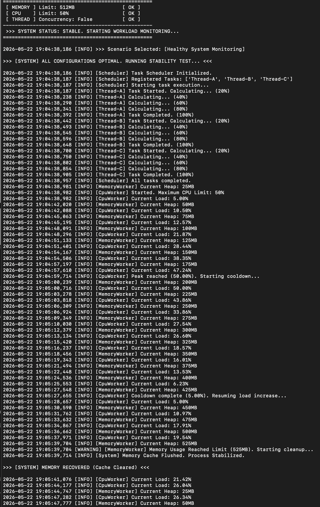
* 환경변수 조정 후 monitor.log 출력 로그
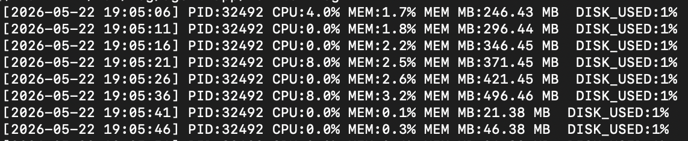
---

## 🛑 [Bug 2] 내부 가상 부하 계산 오류로 인한 Watchdog 프로세스 강제 종료

### 1. 현상 설명 (Description)
* **발생 현상:** 워크로드 모니터링 모듈(`CpuWorker`)이 안전 임계치를 초과하면서, 시스템 감시 장치(`Watchdog`)에 의해 프로세스가 강제 비정상 종료(Emergency Abort)되었습니다.
* **발생 조건:**
  * 발생 시각: 19시 38분 08초 
  * 하드웨어 제약: Memory Limit 512MB / CPU Limit 100% / Thread Concurrency False (단일 스레드 모드) 
  * 진행 상황: `CpuWorker` 구동(19시 37분 44초) 후 약 24초 동안 CPU 부하(Current Load)가 5.00%에서 시작해 매 3초마다 약 5~8%씩 선형적으로 지속 상승함.
### 1-2. 증거자료 (Evidence & Logs) 
* agent-app-leak 실행 로그
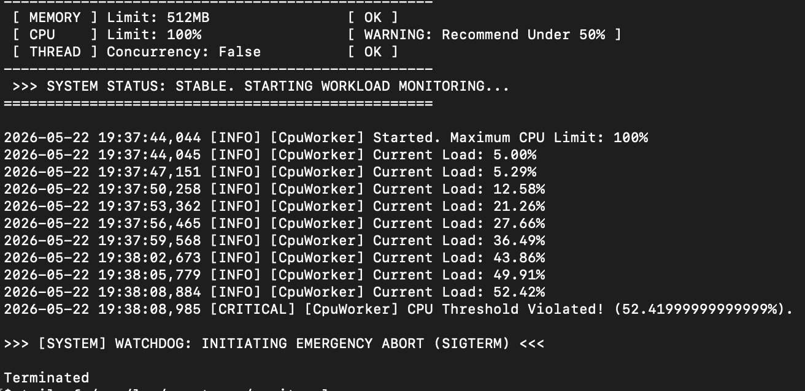
* monitor.log 출력 로그
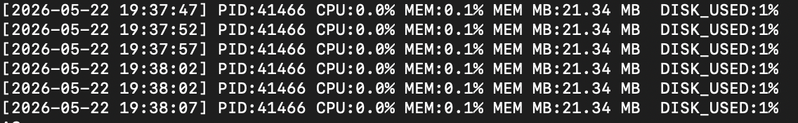

### 2. 원인 분석 (Root Cause Analysis)
* **컨텍스트 불일치:** 내부 알고리즘 계산 로직과 외부 OS 커널 간의 부하 측정 방식에 차이가 발생했습니다.
* **내부 상태:** `CpuWorker`가 자체 연산을 수행하며 내부 변수(`Current Load`)를 52.42%까지 올렸고, 권장치인 50%를 초과하면서 `Watchdog` 트리거 규칙에 의해 `SIGTERM`이 호출되었습니다.
* **OS 프로세스 상태:** 동일 시간대의 OS 커널 모니터링 로그 분석 결과, 실제 소비한 하드웨어 자원은 `CPU: 0.0%`로 고정되어 자원 고갈은 없었습니다.
* **결론:** OS 커널에 의한 자원 회수가 아니라, 애플리케이션 내부 `Watchdog`이 소프트웨어 임계치 규칙을 엄격하게 적용하여 자가 종료(Self-abort)를 유도한 결함입니다.

### 3. 조치 및 검증 (Workaround & Verification)
* **환경변수 조정:** 내부 시뮬레이터 및 `Watchdog` 기준 최대 CPU 한계치를 **50%로 하향 조정**하여 위험 피크치 도달 전 선제적 제어 루틴이 돌 수 있도록 소프트웨어 마진을 확보했습니다.
* **검증 결과:**
  * 부하가 임계치에 근접한 46.65%에 도달했을 때 피크 상태로 인지, 억제 알고리즘(`Peak reached (50.00%). Starting cooldown...`)이 강제 구동되어 부하를 스스로 하향 안정화하는 데 성공했습니다.
  * 쿨다운 제어 시 OS 로그 상 실제 CPU 사용량은 7.8% 수준의 일시적 피크 후 다시 0.0%로 내려앉으며 시스템 행(Hang) 없이 유연하게 자원을 반납하는 흐름을 검증했습니다.
### 3-2. 증거자료 (Evidence & Logs)
* 환경변수 조정 후 agent-app-leak 실행 로그
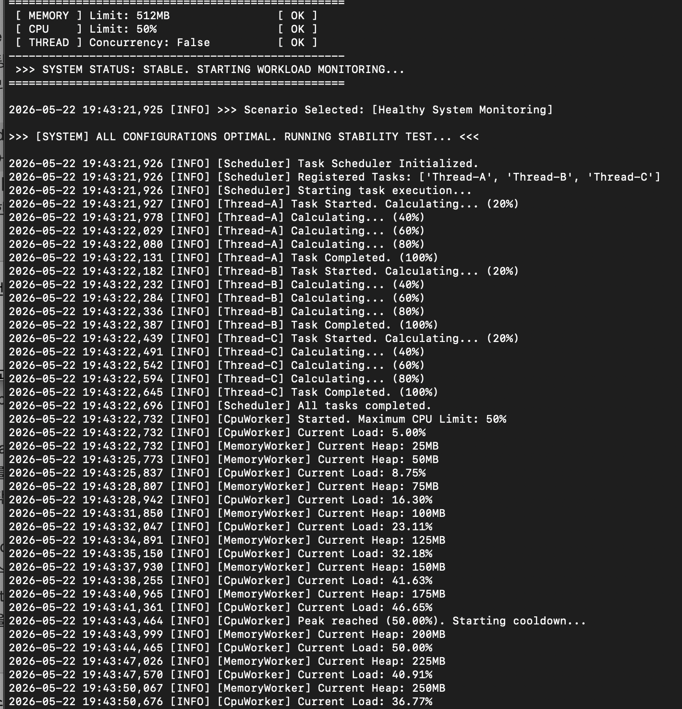
* 환경변수 조정 후 monitor.log 출력 로그
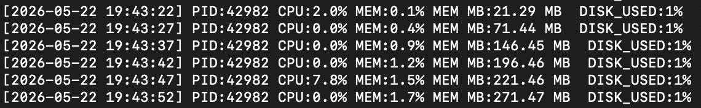
---

## 🛑 [Bug 3] 동시성 제어 오류 - 멀티스레드 교착 상태 (Deadlock)

### 1. 현상 설명 (Description)
* **발생 현상:** 멀티스레드 환경에서 두 스레드가 서로 상대방이 독점한 자원을 무한정 기다리는 전형적인 상호 배제적 교착 상태(Deadlock)가 발생하여 트랜잭션 처리가 완전히 중단되었습니다.
  * `Worker-Thread-1`: `Shared_Memory_A` 점유 ➡️ `Socket_Pool_B` 자원 요청 대기 (`BLOCKED`) 
  * `Worker-Thread-2`: `Socket_Pool_B` 점유 ➡️ `Shared_Memory_A` 자원 요청 대기 (`BLOCKED`) 
* **발생 조건:**
  * 발생 시각: 18시 21분 44초 
  * 하드웨어 제약: Memory Limit 512MB / CPU Limit 50% / Thread Concurrency True (멀티 스레드 모드) 
  * 진행 상황: `AgentWorker`가 엄격한 자원 잠금(Strict resource locking)을 활성화한 채로 병렬 처리를 시도하다 자원 획득 순서가 꼬여 프로세스 시작 약 2초 만에 데드락 진입.
### 1-2. 증거자료 (Evidence & Logs)
* agent-leak-app 실행 로그
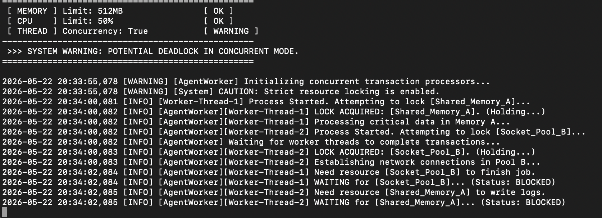
* monitor.log 출력 로그
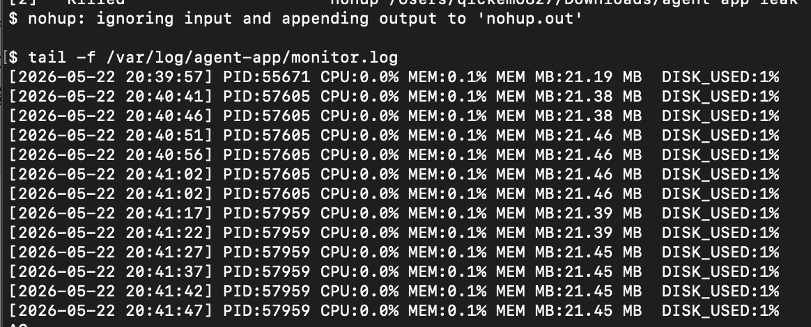

### 2. 원인 분석 (Root Cause Analysis)
Coffman의 데드락 발생 4대 조건을 모두 충족하여 발생한 운영체제 구조적 결함입니다.
1. **상호 배제 (Mutual Exclusion):** Strict resource locking 설정으로 인해 자원이 독점됨.
2. **점유와 대기 (Hold and Wait):** `Worker-Thread-1`이 `Shared_Memory_A`를 가진 채 `Socket_Pool_B`를 대기.
3. **비선점 (No Preemption):** OS나 스레드 스케줄러가 상대 스레드의 Lock을 강제로 해제하지 못함.
4. **순환 대기 (Circular Wait):** 엇갈린 자원 요청으로 인해 대기 사슬이 원형(Circular)을 이룸.

### 3. 조치 및 검증 (Workaround & Verification)
* **환경변수 조정:** `MULTI_THREAD_ENABLE` 환경 변수를 기존 true에서 **false(단일 스레드 모드)로 변경**하여 '점유와 대기' 및 '순환 대기' 구조를 원천 차단했습니다.
* **검증 결과:**
  * `[THREAD] Concurrency: False` 옵션이 정상 주입된 것을 확인했습니다.
  * 자원이 엉키던 `Thread-A`, `Thread-B`, `Thread-C`가 스케줄러의 제어 아래 대기 상태(Blocked) 없이 **순차적으로 계산을 시작 및 완료**(`Task Completed (100%)`)하여 안전하게 자원을 반환 완료했습니다.
### 1-2. 증거자료 (Evidence & Logs)
* 환경변수 조정 후 agent-app-leak 실행 로그
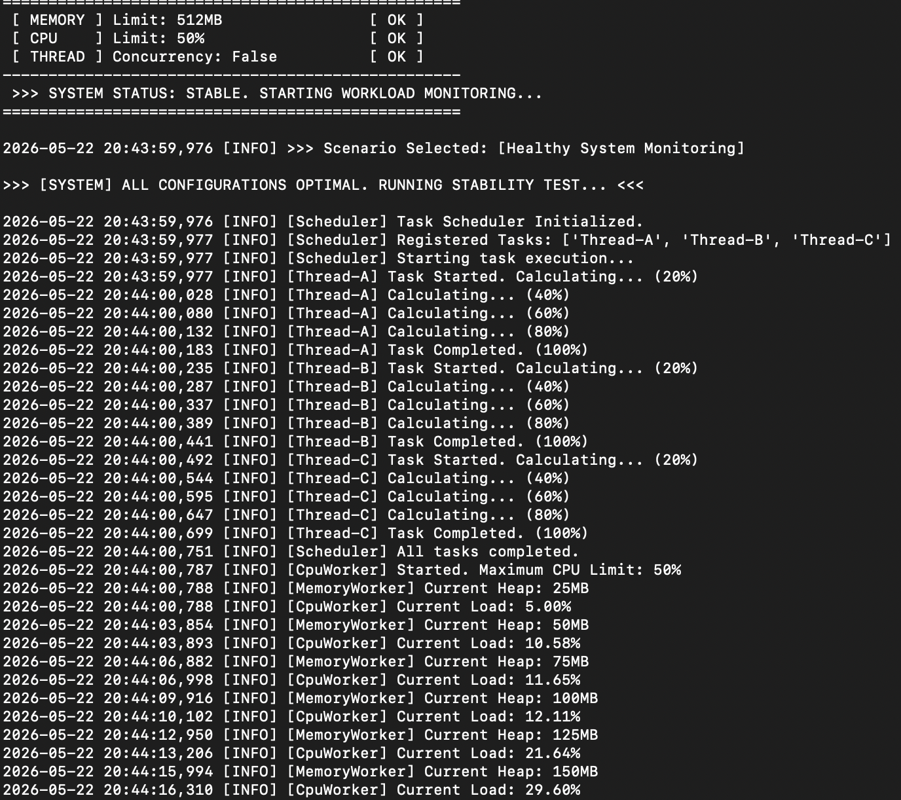
* 환경변수 조정 후 monitor.log 출력 로그
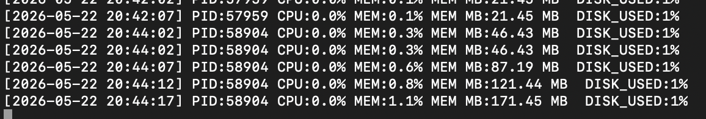